<h3 style="color: #0969da;"> Hi, I'm Trang 👋</h3>

**Senior Software Engineer** who enjoys building **resilient, high-throughput software systems**. I work across different domains, technologies, and programming languages, and thrive on learning the tools and practices needed to contribute effectively to each project. What excites me most is **AI-assisted development** — using **Cursor, Claude Code, and AI Skills** to move faster, test smarter, and debug more effectively. My day-to-day work includes **backend services, REST/gRPC APIs, microservices, distributed systems, CI/CD, and observability**. Above all, I love turning ideas and requirements into **reliable, production-ready software**.

  

