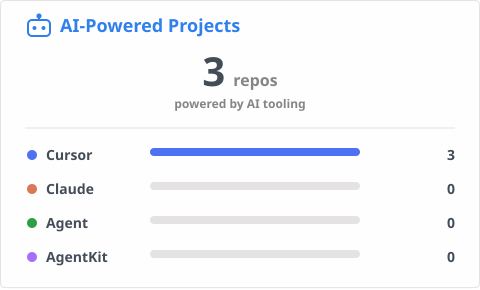

<h3 style="color: #0969da;"> Hi, I'm Trang 👋</h3>

I'll be happy to meet you more! 😊

**Senior Software Engineer** who loves building resilient, high-throughput backend systems in **Golang**. I'm passionate about **banking & payment systems**, where reliability and clean architecture truly matter. What excites me most is **AI-assisted development** — using **Cursor, Claude Code, and AI Skills** to move faster, test smarter, and debug effortlessly. My day-to-day spans **microservices, REST/gRPC APIs, distributed systems**, and observability across **AWS and CI/CD**. Above all, I love turning an idea from a blank canvas into **production-ready software**.

  
  
   
  

