<h3 style="color: #0969da;"> Hi, I'm Trang 👋</h3>

**Senior Software Engineer** who enjoys building **resilient, high-throughput software systems** — and loves turning ideas and requirements into **reliable, production-ready software**.

🔭 &nbsp;**Day-to-day** — backend services, REST/gRPC APIs, microservices, distributed systems, CI/CD, and observability.

🤖 &nbsp;**What excites me most** — AI-assisted development with **Cursor, Claude Code, and AI Skills** to move faster, test smarter, and debug more effectively.

🌐 &nbsp;**How I work** — across different domains, technologies, and programming languages, thriving on learning the tools and practices needed to contribute effectively to each project.

  

  
<b>🤖 AI-enabled — how these projects use AI</b>

  - **Claude Code** — repo phát triển chủ yếu với Claude Code.
  - **Cursor** — repo phát triển chủ yếu với Cursor.
  - **Other AI Assistants** — Codex, Kiro, Droid và các coding agent/assistant khác.
  - **AI-Powered Features** — sản phẩm có feature AI cho người dùng hoặc hệ thống sử dụng trực tiếp, như OCR, RAG, chatbot, classification, extraction, agent workflow.

